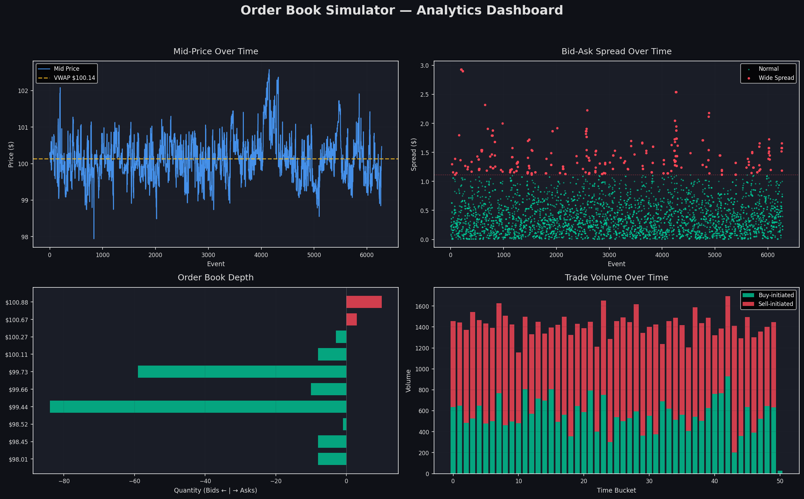

# Order Book Simulator

A high-performance, price-time priority limit order book (LOB) simulator built in pure Python. Processes 10,000+ orders/sec with realistic market microstructure modeling.

## What is an Order Book?

An order book is the core data structure at the heart of every modern financial exchange. It maintains two sorted lists — **bids** (buy orders) and **asks** (sell orders) — organized by price. When a trader submits an order to buy at a price that meets or exceeds the lowest available sell price, a trade is executed. The order book continuously tracks the best available prices on each side, and the gap between them — known as the **bid-ask spread** — is a key indicator of market liquidity and efficiency.

Order books power everything from the NYSE to cryptocurrency exchanges. They provide full transparency into the supply and demand dynamics at every price level. The **depth** of the book (how much volume sits at each price level) reveals the market's willingness to trade, while the flow of orders arriving, being filled, and being cancelled creates the complex microstructure patterns that quantitative researchers study to build trading strategies.

## How Price-Time Priority Works

This simulator implements **price-time priority (FIFO)** matching — the standard algorithm used by most major exchanges:

1. **Price Priority**: Orders offering a better price are matched first. A buy order at $100.05 gets filled before one at $100.00. A sell order at $99.95 gets filled before one at $100.00.

2. **Time Priority**: Among orders at the same price level, the one that arrived first gets filled first (First-In, First-Out). This is implemented using `collections.deque` at each price level.

3. **Matching Trigger**: A trade occurs whenever the best bid price ≥ best ask price. The execution price is the **resting** order's price (the order that was already on the book).

## Architecture

```
order.py          → Order and Trade dataclasses with enums
order_book.py     → SortedDict-backed matching engine (O(log n) price ops)
simulator.py      → Random order generator with Normal/LogNormal distributions
analytics.py      → VWAP, spread, imbalance, fill rate (pandas post-sim only)
visualizer.py     → 2×2 matplotlib analytics dashboard
main.py           → CLI entry point
```

## Installation

```bash
pip install sortedcontainers matplotlib pandas numpy
```

## Usage

```bash
# Default run: 5000 orders, 200 rounds
python main.py

# Full run with visualization
python main.py --orders 10000 --rounds 500 --plot

# Custom configuration
python main.py --orders 5000 --rounds 200 --price 150.0 --seed 123 --plot

# Save chart to file
python main.py --orders 10000 --rounds 500 --save-plot output.png
```

### CLI Arguments

| Flag           | Default | Description                          |
|----------------|---------|--------------------------------------|
| `--orders`     | 5000    | Total number of orders to simulate   |
| `--rounds`     | 200     | Number of simulation rounds          |
| `--price`      | 100.0   | Initial reference price              |
| `--seed`       | 42      | Random seed for reproducibility      |
| `--plot`       | false   | Show matplotlib dashboard            |
| `--save-plot`  | None    | Save the plot to a file path         |

## Sample Output

```
====================================================
  ORDER BOOK SIMULATION - ANALYTICS REPORT
====================================================

  Orders submitted                 10,000
  Trades executed                   8,505
  Orders cancelled                     78
  Fill rate                        88.00%

  Avg spread                   $   0.4015
  Min spread                   $   0.0100
  Max spread                   $   2.9300

  VWAP                         $ 100.1361
  Start mid-price              $ 100.2350
  End mid-price                $ 100.4700
  Price drift                  +0.23%

  Book imbalance                   0.8660
    -> Interpretation          Mild buy pressure

  Trade size - mean                  8.36
  Trade size - median                6.00
  Trade size - std                   7.14

  Buy-initiated volume             28,416
  Sell-initiated volume            42,704
====================================================
```

## Visualization Dashboard

The `--plot` flag generates a 2×2 analytics dashboard:



1. **Mid-Price Over Time** — Line chart with VWAP overlay (dashed yellow)
2. **Bid-Ask Spread** — Scatter plot with red anomaly highlighting (>2σ)
3. **Order Book Depth** — Horizontal bars: green bids (left), red asks (right)
4. **Trade Volume** — Stacked bars colored by buy/sell initiated


## Key Metrics

| Metric | Description |
|--------|-------------|
| **Fill Rate** | Percentage of orders that received at least a partial fill |
| **VWAP** | Volume-Weighted Average Price: Σ(price × qty) / Σ(qty) |
| **Spread** | Difference between best ask and best bid |
| **Book Imbalance** | (bid_vol − ask_vol) / (bid_vol + ask_vol); >0 = buy pressure |
| **Price Drift** | Percentage change in mid-price from start to end |

## Performance

- **10,000 orders in < 1 second** on modern hardware
- `SortedDict` from `sortedcontainers` for O(log n) price-level operations
- `collections.deque` for O(1) FIFO at each price level
- **No pandas** inside the matching engine — pure Python hot path

## License

MIT
